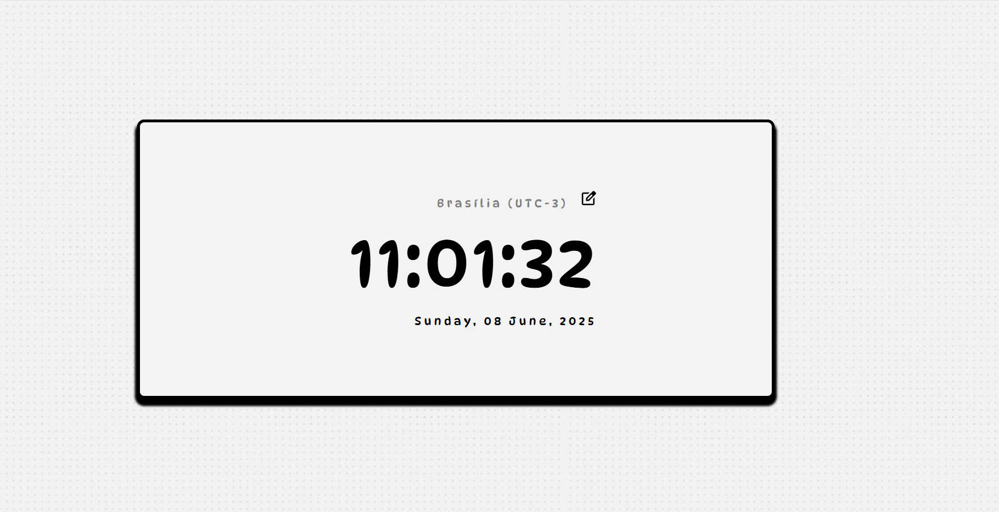

# 🌐 Hora Mundi

Relógio digital com suporte a múltiplos fusos horários internacionais. Feito com HTML, CSS, JavaScript, [Day.js](https://day.js.org/) para manipulação de datas e horários, e [Micromodal.js](https://micromodal.vercel.app/) para janelas modais leves e acessíveis.

 <!-- Substitua por seu banner ou gif animado -->

---

## ✨ Funcionalidades

- ⏰ Mostra o horário local em tempo real
- 🌍 Permite selecionar fusos horários de diversos países

---

## 🚀 Demonstração

<!-- Substitua pelo seu link ou gif -->


Você pode testar a versão online aqui:  
🔗 [Hora Mundi no GitHub Pages](https://filipesvb.github.io/hora-mundi)

---

## 🛠️ Tecnologias Utilizadas

- **HTML5**
- **CSS3**
- **JavaScript (ES6+)**
- 📦 [Webpack](https://webpack.js.org/) – empacotador de módulos
- 📅 [Day.js](https://day.js.org/) – manipulação e formatação de datas
- 🪟 [Micromodal.js](https://micromodal.vercel.app/) – criação de modais acessíveis

---

## 📂 Como Usar

```bash
# Clone o repositório
git clone https://github.com/seuusuario/hora-mundi

# Acesse a pasta do projeto
cd hora-mundi

# Instale as dependências
npm install

# Rode o projeto em modo desenvolvimento
npm start

# Ou gere os arquivos otimizados para produção
npm run build
```

O Webpack irá compilar os arquivos em tempo real e gerar a versão de desenvolvimento dentro da pasta dist/.

## 🧭 Para visualizar o projeto:

- Abra manualmente o arquivo dist/index.html no seu navegador, ou

- Use a extensão Live Server no VS Code para recarregamento automático
